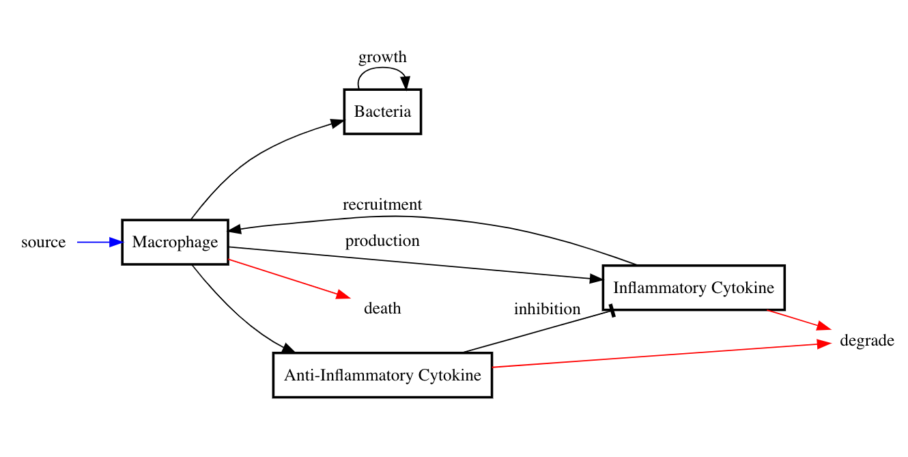

```{r setup, include=FALSE}
knitr::opts_chunk$set(echo = FALSE)
library(deSolve)
library(tidyverse)
library(ggformula)
library(patchwork)
theme_set(theme_light())
```

# Goals

After reading this section of notes, you should

1) have developed a greater appreciation for the basic work flow of biomathematics, 

2) know the meaning of "per capita rate of change" as it relates to population growth, 

3) know the basic "exponential growth" model $\frac{dN}{dt} = rN$. 

# Overview 

In the previous lecture, we introduced the basic work flow of biomathematics:

1) Start with some real world phenomenon of interest from the life sciences.
2) By making some set of simplifying assumptions, abstract from the real world in order to highlight essential features for the purposes of answering some specific question or solving some particular problem. 
3) Represent your abstraction from step 2 as a mathematical model.
4) Use techniques from applied mathematics or scientific computing in order to understand the mathematical representation in step 3 with the goal of solving a problem or answering a question. 
5) Place your results from step 4 in the context of the original real world biological phenomenon. 

In this lecture, we will illustrate these steps by way of two examples. One is an extremely simple example about population growth, while the other is an example from a paper concerned with understanding general features of the inflammatory process [@heraldGeneralModelInflammation2010]. 

# Simple Population Growth

Individual organisms typically belong to a population. Understanding the growth of a population is important for understanding the ecology and evolution of organisms. In particular, one may want to know about factors that lead to the extinction of a species. Of course, a population of organisms belongs to an ecosystem in which it interacts with its environment and other species. Before we get carried away and try to understand an entire ecosystem, it is useful to theorize about how a single-species population may change as a function of time. 

Consider a simple isolated and homogeneous population. Let $N(t)$ denote the number (or sometimes density) of individuals in the population at time $t$. For simplicity we will assume that $N$ is a continuous and differentiable function of the continuous variable $t$. Later we will reflect on these assumptions and discuss modifications that could be made if necessary. We define

$\text{per capita rate of change} = \frac{1}{N}\frac{dN}{dt}$

noting that this quantity has units of $\frac{1}{\text{time}}$. The point is that we can arrive at a mathematical model for the growth of a population by specifying a formula for the per capita rate of change. Let's begin with the simplest assumption that we can possibly make, suppose that the per capita rate of change is constant. That is, suppose

$\frac{1}{N}\frac{dN}{dt} = r$.

Then,

$\frac{dN}{dt} = rN$. 

Let's make two observations about this last equation:

1) If $r > 0$, then $rN >0$ (populations are always positive so we assume implicitly that $N > 0$) and thus $\frac{dN}{dt} > 0$. Therefore, if the constant rate $r > 0$, then the population will always be increasing. On the other hand, if $r < 0$, then the population will always be decreasing. 

**Reflection:** Sketch the graph of a function that is always positive and always increasing. Sketch the graph of a function that is always positive and always decreasing. 

2) Given an initial value of the population $N(0) = N_0$, $N(t) = N_{0}e^{rt}$ satisfies the differential equation $\frac{dN}{dt} = rN$. 

**Reflection:** Take a moment to verify this by substituting $N(t) = N_{0}e^{rt}$ into both sides of the equation. In the homework you will be asked to derive this solution using the [method of separation](https://en.wikipedia.org/wiki/Separation_of_variables). (Chances are that you have done this before.)

Let's look at the graph of $N(t) = N_{0}e^{rt}$:

```{r fig1,fig.cap="\\label{fig:fig1} Exponential growth model results.",echo=FALSE,out.width='75%'}
p1 <- gf_function(fun=function(t) 10*exp(0.2*t),xlim=c(0,20)) + 
  labs(x="time",title="Exponential growth (r > 0)")
p2 <- gf_function(fun=function(t) 10*exp(-0.2*t),xlim=c(0,20)) + 
  labs(x="time",title="Exponential decay (r < 0)")
(p1 | p2)
```


(**Note:** It is worth the effort to remember forever and all time that the solution of the differential equation 

$\frac{dx}{dt} = ax$,

with initial condition $x(0)=x_0$ is $x(t) = x_{0}e^{at}$.)

Based on our observations, we see that a population that obeys the model $\frac{dN}{dt}=rN$ will grow (if $r > 0$) or decay (if $r < 0$) in an exponential fashion. 

An obvious question is, what determines if $r$ is positive or negative? One way to make sense of this is to think of $r$ as the difference between the per capita birth rate $b$ and the per capita death rate $d$ so that $r=b-d$. Then $r > 0$ if $b > d$ and $r < 0$ if $b < d$. Thus, a population is predicted to go extinct (in the long run as $t \rightarrow \infty$) if the per capita death rate is greater than the per capita birth rate. 

One problem with the model is that long term exponential growth is unrealistic. The survival of a real population depends on resources such as food and water. An exponentially growing population would soon deplete all available resources. On the other hand, it is not unrealistic for a population to initially grow exponentially when the population numbers are very small relative to the availability of resources. Later on we will discuss ways to adjust the model so that growth is exponential when the population is small but slows as the population increases. 

Notice how we hit each step of the biomathematics work flow during the course of our discussion on population growth. We began with a real world phenomenon, abstracted to an isolated homogeneous population, wrote down a mathematical model, derived information from the model and cast that information in the context of the original real world phenomenon. Let's look at another example of how the biomathematics work flow plays out in the context of more recent research. 


# General Model of Inflammation 

[Inflammation](https://en.wikipedia.org/wiki/Inflammation#:~:text=Inflammation%20(from%20Latin%3A%20inflammatio),blood%20vessels%2C%20and%20molecular%20mediators.) is a normal part of the [immune response](https://en.wikipedia.org/wiki/Immune_response) for defense against invasion by foreign cells or molecules. However, inflammation may become chronic and lead to disease, [sepsis](https://en.wikipedia.org/wiki/Sepsis), and even death. For the purposes of both treatment and prevention of disease, it is important to understand the conditions that lead to chronic inflammation. 

Without going into the biological and chemical details, we know that inflammation is controlled and mediated by immune cells ([the macrophage](https://en.wikipedia.org/wiki/Macrophage)) whose behavior is regulated by signaling molecules known as [cytokines](https://en.wikipedia.org/wiki/Cytokine). Thus, it is reasonable for the purposes of abstraction to encapsulate the immune response by the activities of macrophage cells, cytokines, and an invading body such as a bacteria cell. This is exactly what is done in the paper [@heraldGeneralModelInflammation2010]. 

Figure 2 shows a schematic corresponding to our abstraction of the immune response. The macrophage cell population responds to bacterial invasion and produces cytokines that mediate the immune response. The exact details of the interactions are governed by model parameters and mathematical relationships between the interacting cell populations and cytokines. 

```{r fig2, echo=FALSE, fig.cap="\\label{fig:fig2} Schematic of inflammation model. This corresponds roughly to Figure 1 in [@heraldGeneralModelInflammation2010].", out.width = '100%'}

```


In [@heraldGeneralModelInflammation2010], the author converts the model diagram into a mathematical model in the form of a coupled system of nonlinear differential equations shown here:

\begin{align}
\frac{dM}{dt} &= s + \frac{r C}{1 + k_{1} C} - m_{d} M, \\
\frac{dC}{dt} &=  p_{c} B M + M \frac{a C}{(1 + k_{2} C)}\frac{1}{(1 + k_{3} A)} - c_{d} C,\\
\frac{dA}{dt} &=  p_{a} C M - a_{d} A, \\ 
\frac{dB}{dt} &= g B - b_{d} M B.
\end{align}

Later on in the course we will study this model in more detail. For now, note that

* $M$ - macrophage cell population
* $C$ - inflammatory cytokine concentration 
* $A$ - anti-inflammatory cytokine concentration
* $B$ - bacteria cell population 


In the paper, the author uses the model equations to show that under a certain set of circumstances a bacterial pathogen will not provide a sufficient trigger to cause chronic inflammation. On the other hand, if conditions are right, even a minor bacterial infection can lead to chronic inflammation. We leave the details of the analysis for later in the course. Notice that this example contains all of the components of the basic biomathematics work flow. 

1) The real world phenomenon of interest from the life sciences is inflammation.
2) Figure 2 corresponds to an abstraction of the biochemical details of the immune system highlighting what is thought to be the essential features of the inflammatory response. 
3) Clearly there is a mathematical model. A major portion of this course is devoted to understanding how one might come up with such a system of equations. These were not simply pulled out of thin air. 
4) In [@heraldGeneralModelInflammation2010], the author uses techniques from [dynamical systems](https://en.wikipedia.org/wiki/Dynamical_systems_theory) and [bifurcation theory](https://en.wikipedia.org/wiki/Bifurcation_theory) in order to derive useful information from the model equations. 
5) The author's analysis of the model system explains some aspects of inflammation and pinpoints conditions that lead to chronic inflammation. The authors work also explains why certain therapies for chronic inflammation are not successful. 

There are still many questions about inflammation to be addressed beyond what is done in [@heraldGeneralModelInflammation2010]. However, in order to make progress more details of the immune response may need to be included. This will involve either modifying the system of equations displayed in this section, or using a different mathematical model altogether. For now, the point to take away is that, often times, this is how work in biomathematics proceeds. In the next lecture, we will start to learn some essential principles of mathematical modeling that will help us to see where equations such as the ones presented in this section come from. 

# Further Reading

For those that want to learn more about the topics discussed in this lecture, we provide here some relevant references.  

## Mathematical Models for Population Growth

Introductions to mathematical models for population growth may be found in most of the standard texts in biomathematics. Good places to start are [@allenIntroductionMathematicalBiology2007; @brittonEssentialMathematicalBiology2003; @edelstein-keshetMathematicalModelsBiology2005]. The textbook [@kotElementsMathematicalEcology2001] is entirely devoted to population models. An important application of population growth models is to cancer biology where one is interested to understand the growth of tumor cell populations. Two papers that examine population growth models in the context of tumor cell growth are [@gerleeModelMuddleSearch2013; @sarapataComparisonCatalogIntrinsic2014]. 


## Mathematical Models of Inflammation

Mathematical modeling of inflammation is an area of current research. In addition to the paper already referenced, [@heraldGeneralModelInflammation2010], we also recommend [@dayReducedMathematicalModel2006; @reynoldsReducedMathematicalModel2006]. 
