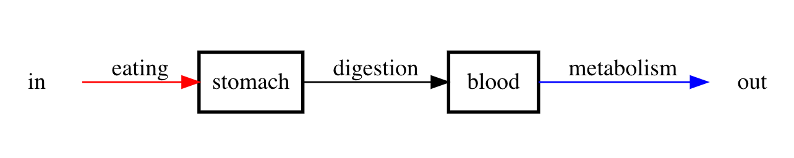
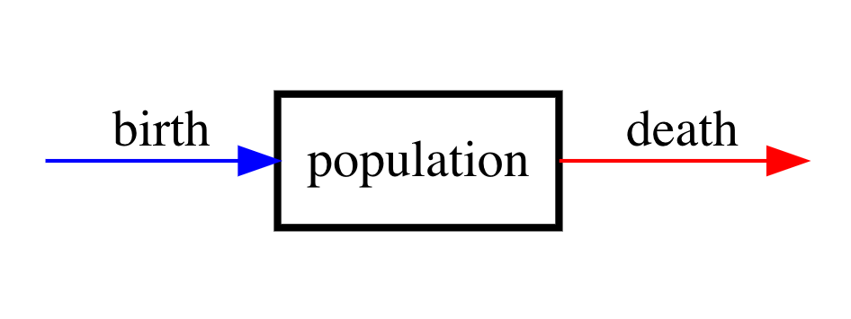
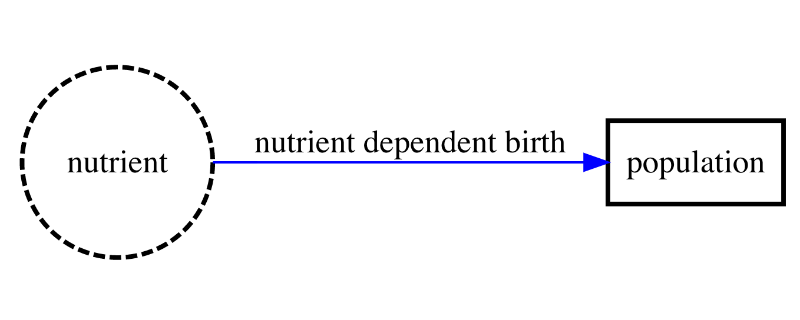
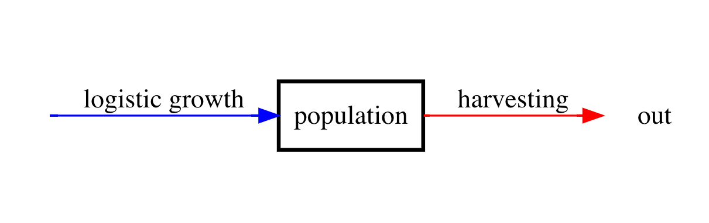
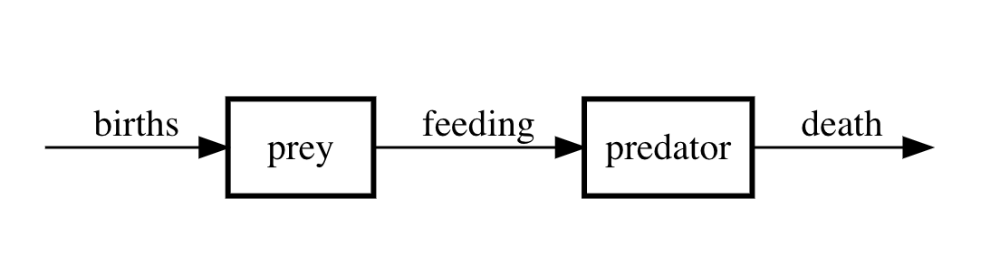
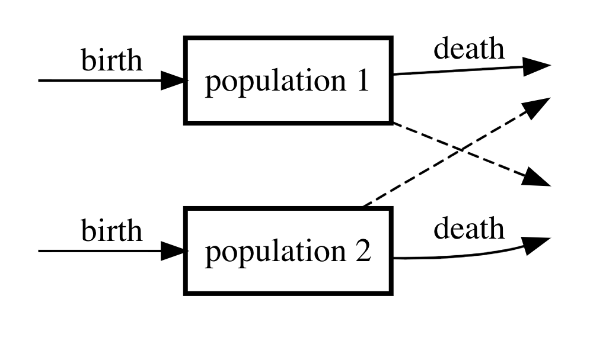
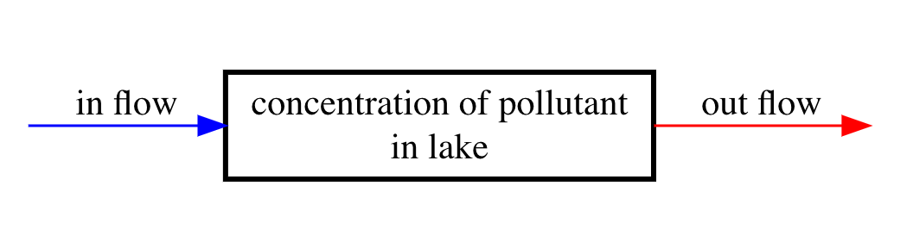

```{r setup, include=FALSE}
knitr::opts_chunk$set(echo = FALSE)
library(deSolve)
library(tidyverse)
library(ggformula)
library(patchwork)
library(phaseR)
library(latex2exp)
theme_set(theme_light())
```


# Goals

After reading this section of notes, you should

1) have a feel for the concepts of compartment models and balance laws, and

2) understand how common population models can be viewed from the perspective of compartment modeling. 

# Overview

Compartment modeling is a framework for the construction of differential equation models for systems that involve one or more time-dependent quantities that form distinct compartments that taken together make up the system of interest. Compartment modeling proceeds by accounting for the processes and interactions that influence the rate of change of the various quantities encapsulated by each of the compartments. Thus, we view a compartment model as a network of time varying quantities where inputs and outputs between nodes of the network determine the factors that influence the time rate of change for those quantities. Typically, an input corresponds to a factor that will increase a compartment quantity while an output corresponds to a factor that will decrease a compartment quantity. 

Soon we will present concrete examples of compartment models. For the moment, let's consider a conceptual example that will help to provide some intuition for the presently vague notion of a compartment. Suppose we are interesting in modeling food to cell metabolism. We can do this with a two-compartment model where one compartment is the stomach and the other compartment is the blood. We are interested in the time-varying energy content of each of the two compartments. Eating is an input and will increase the energy content within the stomach, while digestion will decrease the energy content within the stomach but increase the energy content within the blood. On the other hand metabolic activity will decrease the energy content within the blood and thus is an output for the blood energy content. We can represent the processes just described with the following **compartment diagram.**

```{r fig1, echo=FALSE, fig.cap="Compartment diagram describing the pathway from food to metabolism", fig.width=2,fig.height=5}

```

**R Tip:** Compartment diagrams such as the previous one can be made using the [DiagrammeR package](https://rich-iannone.github.io/DiagrammeR/).

The next step would be to write down differential equations for the rate of change of energy content in the stomach and the rate of change of energy content in the blood. In the next section, we will start to get a feel for how to go from a compartment model and compartment diagram to the corresponding differential equations. 

See both [@barnesMathematicalModellingCase2015; @calvettiComputationalMathematicalModeling2013] for complimentary treaments of [compartment modeling](https://en.wikipedia.org/wiki/Multi-compartment_model#:~:text=A%20multi%2Dcompartment%20model%20is,entities%20being%20modelled%20are%20equivalent.). We note that compartment models are also used in the context of stochastic models, for information about this see the later chapters from [@calvettiComputationalMathematicalModeling2013] or the textbook [@allenIntroductionStochasticProcesses2011]. 

# A Simple Example: Population Models Revisited 

In this section, we look at how we can recast population models in the compartment model framework. We can view a single isolated and homogeneous time-varying population $N(t)$ as making up a single compartment. Then a compartment model for this situation has the following compartment diagram:

```{r fig2, echo=FALSE, fig.cap="Compartment diagram of single-species population model.", fig.width = 2}

```

As a word equation, this model reads

$\left\{\begin{array}{c} \text{rate of change} \\ \text{of population} \end{array} \right\} = \left\{\begin{array}{c} \text{rate of} \\ \text{births} \end{array} \right\} - \left\{\begin{array}{c}  \text{rate of} \\ \text{deaths} \end{array} \right\}$.

Our goal is to covert the word equation corresponding to the compartment diagram into a mathematical equation, specifically a differential equation. Clearly we have that 

$\left\{\begin{array}{c} \text{rate of change} \\ \text{of population} \end{array} \right\} = \frac{dN}{dt}$,

what remains is to determine mathematical expressions for the rate of births and rate of deaths. In general, inputs and outputs in compartment models may be constants, functions of time, or functions of one or more of the other compartment variables. In terms of the single-species population model, it is reasonable to initially assume that both the rate of births and rate of deaths are proportional to the population $N$. Why is that? First off, if the initial population is zero, then the population should never increase or decrease. Furthermore, we don't yet have a strong reason to assume any more complicated functional dependencies for the birth and growth rates. Thus, to begin we assume that 

$\left\{\begin{array}{c} \text{rate of} \\ \text{births} \end{array} \right\}=bN,\ \ \left\{\begin{array}{c} \text{rate of} \\ \text{deaths} \end{array} \right\} = dN$,

where $b$ and $d$ are both positive constants. 

This leads to the differential equation model

$\frac{dN}{dt} = bN - dN = (b-d)N$.


As we have already seen, this models leads to either exponential growth (when $b > d$) or exponential decay (when $b < d$). Now exponential growth is unrealistic for a long-term model of a population that depends on some limited resource in order to persist. This suggests that we might want to consider a different model and specifically, we may want to revisit our assumption that the rate of birth is directly proportional to the population. This is taken up in the following subsection.  

## Logistic Growth

Let's momentarily suppose that we can ignore deaths and consider a model corresponding to the following diagram:

```{r fig3, echo=FALSE, fig.cap="Compartment diagram of single-species population model with nutrient dependent birth rate.", fig.width = 2}

```

Let $C(t)$ be the time-dependent concentration of some (limited) nutrient that the population requires in order to persist. A corresponding mathematical model is then

$\frac{dN}{dt} = r(C)N$,

where $r(C)$ is the growth rate that depends as a function on $C$. As is, we do not have enough information to solve this differential equation. That is because as is, both $N$ and $C$ are unknowns and we cannot solve a system of differential equations where the number of unknowns is not equal to the number of equations. We are left with three options:

1) Provide an explicit expression for $C(t)$. For example, maybe we assume that the nutrient concentration decreases over time and thus set $C(t) = e^{-\alpha t}$, where $\alpha$ is the rate at which the nutrient depletes. Of course there are (potentially infinitely) many other options for an expression for $C(t)$. The problem with this approach is that any particular choice for $C(t)$ is likely to apply in only very specific situations.  

2) Derive an additional differential equation for $C(t)$. The problem with this approach is that additional information or assumptions are necessary to do this. 

3) Determine an expression for $C$ in terms of $N$ (and perhaps also some parameters). We will now take up this approach and see that it leads to an interesting result.  

A reasonable assumption is that as the population increases, the nutrient will decrease. That is,

$\frac{dC}{dt} = -\alpha \frac{dN}{dt}$,

where $\alpha > 0$ is a constant. Rearranging the previous equation shows that

$\frac{dC}{dt} + \alpha \frac{dN}{dt} = \frac{d}{dt}(C + \alpha N) = 0$. Therefore, we have that $C + \alpha N = \text{constant}$ and we will denote this constant by $q$. From this, we determine that 

$C = q - \alpha N$,

Now let's think about how $r$ could depend on $C$. In mathematical modeling, one typically starts with the simplest reasonable expression. In our case, that would be to assume that $r$ is a linear function of $C$. That is,

$r(C) = a_{1}C + a_{0},$

where $a_{0}$ and $a_{1}$ are constants. Further, if there is no nutrient available, then there should be no growth. Therefore, $r(0) = 0$ from which we conclude that $a_{0}=0$. Then 
putting together $C = q - \alpha N$ and $r(C)=a_{1}C$ leads to 

$r(C) = a_{1}(q - \alpha N) = a_{1}q\left(1 - \frac{N}{\frac{q}{\alpha}}\right)$.

Then, our differential equations becomes 

$\frac{dN}{dt} = a_{1}q\left(1 - \frac{N}{\frac{q}{\alpha}}\right)N$.

Let's take a moment to reflect on the meaning of the parameters in our last expression. The constant $q$ has units of concentration and thus $a_{1}q$ is the growth rate. On the other hand $\alpha$ is a ratio of nutrient concentration per unit of population. This means that $\frac{q}{\alpha}$ tells us about how much nutrient it takes to support a given sized population provided that the population consumes nutrient at some particular rate (determined by $\alpha$). Based on this, we define new parameters $r = a_{0}q$ (the growth rate) and $K = \frac{q}{\alpha}$ (the carrying capacity). This leads finally to the so-called [**logistic growth**](https://en.wikipedia.org/wiki/Logistic_function) model

$\frac{dN}{dt} = r\left(1 - \frac{N}{K}\right)N$. 

In the homework, you will derive a closed form solution for this equation. (You can use the method of separation in the form 

$\int \frac{dN}{\left(1 - \frac{N}{K}\right)N} = \int r dt,$

and then use partial fractions to compute the left hand indefinite integral). 


Even without solving the differential equation, we can deduce the behavior of the population that is implied by the model. First, both sides of the equation are a statement about the time rate of change of $N$. This is because the derivative $\frac{dN}{dt}$ is by definition the time rate of change of $N$ and since the right side equals the left side, $r\left(1 - \frac{N}{K}\right)N$ must also determine the time rate of change of $N$. 

Now, if the population $N$ is much smaller than the carrying capacity $K$, then $\left(1 - \frac{N}{K}\right) \approx 1$ and thus $\frac{dN}{dt} \approx rN$. This suggests that when the population is small the growth is exponential. However, as $N$ approaches $K$ the quantity $\left(1 - \frac{N}{K}\right)$ gets closer and closer to zero which suggests that the growth of the population approaches zero. Further, at $N=0$ and $N=K$ we have that $r\left(1 - \frac{N}{K}\right)N=0$. That is, $N=0$ and $N=K$ are steady-state solutions to 

$\frac{dN}{dt} = r\left(1 - \frac{N}{K}\right)N$.

Based on our previous discussion we should suspect that $N=K$ is a **stable** steady-state because for any starting population the species will grow so as to approach but never surpass the carrying capacity $K$. (You should think about what will happen if we initially begin with a population that is greater than $K$.) Either recall or note that the differential equation $\frac{dN}{dt} = r\left(1 - \frac{N}{K}\right)N$ is a nonlinear autonomous (that is, no explicit dependence on $t$) equation. Dynamical systems theory provides techniques for the qualitative analysis of nonlinear autonomous equations (and systems) and we will take up a much more detailed study of these methods later on. For now, suffice it to say that a graph of $F(N) = r\left(1 - \frac{N}{K}\right)N$ will show us how we expect the system to respond (in terms of increasing or decreasing behavior) for any particular initial population value.

```{r,echo=FALSE}
f <- function(t,N,parameters){list(N*(1-N))}
nondim_logistic_phasePortrait <- phasePortrait(f,
                                        ylim   = c(-0.5, 1.5),
                                        points = 10,
                                        frac   = 0.5,
                                        state.names = "N")
```

The last plot shows the graph of $F(N) = r\left(1 - \frac{N}{K}\right)N$ from which we see that the population will decrease if $N < 0$ or $N > K$ and the population will increase if $0 < N < K$. The steady-state values occur at the $x$-intercepts. We see that $N=K$ is a stable steady-state because it is robust to small perturbations. This previous construction is called the phase line. 

The following plot shows solutions to $\frac{dN}{dt} = r\left(1 - \frac{N}{K}\right)N$ for four different initial conditions. 

```{r,echo=FALSE}
nondim_logistic_flow <- flowField(f,
                                 xlim       = c(0, 6),
                                 ylim       = c(-0.5, 1.5),
                                 parameters = NULL,
                                 points     = 15,
                                 xlab       = "t",
                                 ylab       = "N",
                                 system     = "one.dim",add=FALSE)
nondim_logistic_solutions <- trajectory(f,
                                        y0   = c(0,0.5,1,1.5),
                                        tlim=c(0,10),
                                        system = "one.dim")
```
From this figure, we see that if $N(0) = 0$ or if $N(0)=K$ then there is no change over time. However, if $N(0)$ is any other positive value then the solution to $\frac{dN}{dt} = r\left(1 - \frac{N}{K}\right)N$ approaches $K$
 as time increases. 

We will say more about this later but the last two plots are obtained using the [`phaseR` package](https://cran.r-project.org/web/packages/phaseR/vignettes/my-vignette.html) which is an R package for the qualitative analysis of one- and two-dimensional autonomous ODE systems, using phase line/plane methods. (You can also learn more about this by reading our [R for Biomath page](https://topicsinbiomath.netlify.app/r_for_biomath.html).) This package will turn out to be very useful for us. Let's move on to look at some extensions of our single population model before moving on to some other examples of compartment models. 

## Harvesting

As a sort of application of our logistic growth model, let's consider the impact of **harvesting** on the dynamics of a population. As you can probably imagine, harvesting is the extraneous removal of individuals from a population. A good example of harvesting is fishing. To start with, we will consider a very simple scenario. Suppose that we want to study the impact of fishing with the specific goal of examining what amount of fishing can be supported in order to avoid the total depletion of the fish population found say, in a small lake or pond. Let's assume that our study occurs over a small enough time-frame that the death rate is negligible compared with the rate of harvesting, *i.e.*, fishing. Because we are considering a fish population in a small isolated body of water it should be very reasonable to assume logistic growth because resources are obviously limited. A diagram for the situation we have described is as follows:

```{r fig4, echo=FALSE, fig.cap="Compartment diagram of harvesting model.", out.width = '60%'}

```

Let $h$ denote the harvesting rate. We will begin by assuming that $h$ is a constant so that harvesting is independent of the population size (this can be viewed as setting a quota at the beginning of fishing season). Then our mathematical model is

$\frac{dN}{dt} = r\left(1 - \frac{N}{K}\right)N - h$.

Now, the steady-states to this equation are given by solutions to the quadratic equation $r\left(1 - \frac{N}{K}\right)N - h = 0$. In the homework, you will show using the quadratic formula that these are given by 

$N = \frac{K}{2}\left(1 \pm \sqrt{1 - \frac{4h}{Kr}} \right)$. 

It should be clear that if the ratio $\frac{4h}{Kr}$ is too large then $1 - \frac{4h}{Kr} < 0$ which leads to a problem since the expression under the radical will be negative. On the other hand, if $\frac{4h}{Kr}$ is sufficiently small, then there will be two positive steady-states. Let's explore what can happen by graphing $f(N) = r\left(1 - \frac{N}{K}\right)N - h$ in the cases where $\frac{4h}{Kr}$ is "large" versus when $\frac{4h}{Kr}$ is "small". (Later on we will be more explicit about what exactly we mean by large versus small). 

```{r,echo=FALSE}
F <- function(N,h=0.5){N*(1-N) - h}
x <- seq(-0.75,1.75,by=0.01)
df <- tibble(x=x)
p1 <- ggplot(df,aes(x)) + geom_function(fun=F,args=list(h=0.08)) + geom_hline(yintercept = 0,linetype="dashed") + labs(x="N",y="dN/dt",title=TeX("$\\frac{4h}{Kr}$ small"))
p2 <- ggplot(df,aes(x)) + geom_function(fun=F,args=list(h=0.3)) + geom_hline(yintercept = 0,linetype="dashed") + labs(x="N",y="dN/dt",title=TeX("$\\frac{4h}{Kr}$ large"))
(p1 | p2)
```

The two previous plots illustrate the following:

1) If $\frac{4h}{Kr}$ is sufficiently small then there are two positive steady-states for a population that obeys the harvesting model. Furthermore, one of these steady-states will be a stable steady-state. The biological interpretation is that when harvesting is small relative to the carrying capacity and growth rate then the population can persist despite removal due to harvesting. 

2) If $\frac{4h}{Kr}$ is sufficiently large then there are no positive steady-states for a population that obeys the harvesting model and the population will decrease over time. The biological interpretation is that when harvesting is large relative to the carrying capacity and growth rate then the population cannot persist given the removal due to harvesting. 

It should be intuitively obvious that there is a single intermediate stage (occurring when $\frac{4h}{Kr} = 1$) that separates the two situations that we just described. We say that this model exhibits a **bifurcation** that occurs a some critical value for the relationship between the model parameters. Bifurcations are common in biomathematical models and we will spend some time later reviewing those aspects of [bifurcation theory](https://en.wikipedia.org/wiki/Bifurcation_theory) that are most frequently applied in biomathematics. 

Before moving on, let's look at some actual solutions to the differential equation

$\frac{dN}{dt} = r\left(1 - \frac{N}{K}\right)N - h$.

We will use the [`deSolve` package](http://desolve.r-forge.r-project.org/) that implements [numerical methods for differential equations](https://en.wikipedia.org/wiki/Numerical_methods_for_ordinary_differential_equations) to compute said numerical solutions. Later in the course we will explain in detail how to use the `deSolve` package, for now we just display the results. (You can also learn more about this by reading our [R for Biomath page](https://topicsinbiomath.netlify.app/r_for_biomath.html).)

```{r,echo=FALSE,warning=FALSE,message=FALSE}
harvest_model <- function(time,N,parms){
  with(as.list(c(N,parms)),{
    dN <- r*N*(1-N/K) - h
    return(list(dN))
  })
}
times1 <- seq(0,10,by=0.01)
N <- c(N=0.25)
sol1 <- data.frame(ode(N,times1,harvest_model,c(r=1,K=1,h=0.08)))
times2 <- seq(0,1.4,by=0.01)
sol2 <- data.frame(ode(N,times2,harvest_model,c(r=1,K=1,h=0.3)))
p1 <- ggplot(sol1,aes(x=time,y=N)) + geom_line(lwd=1) + labs(title=TeX("$\\frac{4h}{Kr}$ small"))
p2 <- ggplot(sol2,aes(x=time,y=N)) + geom_line(lwd=1) + labs(title=TeX("$\\frac{4h}{Kr}$ large"))
(p1 | p2)
```

What these two plots show is that when $\frac{4h}{Kr}$ is small the population grows to some stable level (which is no longer the carrying capacity). On the other hand, if  $\frac{4h}{Kr}$ is too large the population crashes.  

What we have learned is that over fishing (or more generally over harvesting) will occur if the harvesting rate is critically greater than the growth rate and carrying capacity together. 

Now that we have a feel for single-species population models, let's examine some problems that involve the interactions of two or more species. 

## Interacting Populations 

There are several different ways in which two or more species may interact. Some of the most common are

1) predator-prey interactions,
2) competitive interactions, and 
3) mutualism. 

In this subsection we will look at both predator-prey interactions and competitive interactions and save the topic of mutualism for later. 

### Predator-prey Interactions

In predator-prey interactions, one species persists by way of consuming another. We start by assuming that this interaction is unidirectional in that the predator feeds on the prey (which is a limited resource) but that the prey persists on some much more widely available resource. Think of rabbits and foxes where the rabbit is the prey and the fox the predator.

We will also assume that predation is by far the most significant cause of death for the prey population. The following compartment diagram provides an illustration of the idea behind the model. 

```{r fig5, echo=FALSE, fig.cap="Compartment diagram of predator-prey model.", out.width = '70%'}

```

If we let $X(t)$ denote the prey population and $Y(t)$ denote the predator population, then under the simplest assumptions for the rates the differential equation model corresponding to the compartment diagram is

\begin{align}
\frac{dX}{dt} &= aX - bXY \\
\frac{dY}{dt} &= \alpha b XY - d Y
\end{align}

We will study the behavior of this model later, for now note the following points:

1) The predators cannot persist in the absence of prey.

2) As the predator population increases there is a strong possibility for the prey population to decrease. If $Y$ gets sufficiently large, then $bY$ will be greater than $aX$ which will result in $X$ decreasing. 

3) On the other hand, due to the first point, when $X$ becomes too small then $Y$ cannot grow very quickly, if at all. 

If we take the last three points together, it seems like the predator-prey model may result in cyclic (periodic) behavior. In fact, periodic behavior is a common feature of many mathematical models for biological systems. Later in the course, we will study some techniques for examining the existence of periodic dynamics.  


### Competitive Interactions

How is competition different from the predator-prey interaction? In this situation, the two may not interact "directly" such as in the predator-prey relationship. However, since the two species are trying to persist in the same ecosystem and depend on the same resources there is a competitive stress that could impact the mutual existence of both species. There are a few different ways in which competitive stress can arise. Probably the simplest is the case that is captured by the following compartment diagram.

```{r fig6, echo=FALSE, fig.cap="Compartment diagram of competition model.", fig.width = 2}

```

If we denote by $N_{1}$ the first population and by $N_{2}$ the second, then the corresponding differential equation model is

\begin{align}
\frac{dN_{1}}{dt} &= b_{1}N_{1} - d_{1}N_{1}N_{2} \\
\frac{dN_{2}}{dt} &= b_{2}N_{2} - d_{2}N_{1}N_{2}
\end{align}

The question that we can try to answer with the model (we will work out details later) is, can both species coexist or will one always out compete the other. Later we will also see other ways in which two or more species can compete. 


# Another Compartment Model Example

Compartment models are often employed together with **balance laws**. Balance laws arise from the fact that certain physical quantities such as mass, momentum, and energy are conserved in the sense that they cannot be created or destroyed without the action of some intervening processes.  Thus, the rate of change of a conserved quantity is specified by accounting for the in-flow, out-flow, and production (source) and degradation (sink) processes. 

An important point to take into account is that not all common quantities are conserved. For example, one is often interested to construct a model for the rate of change in the concentration of some chemical. Concentration is not a conserved quantity. However, mass is conserved and concentration is mass per unit volume. Therefore, we can obtain a conserved quantity from a concentration by multiplying the concentration by volume resulting in a quantity with units of mass. 

We now present a simple example to illustrate a compartment model/balance law application. Suppose that we want to study pollution in a body of water of a fixed volume $V$. Suppose that the pollutant flows into the lake with constant concentration $c_{\text{in}}$ with in-flow rate $F$ (in units of volume per unit time) and flows back out at the same rate. The following compartment diagram displays what is happening.    

```{r fig7, echo=FALSE, fig.cap="Compartment diagram of lake pollutant model.", out.width = '70%'}

```

In words, we have

$\left\{\begin{array}{c}  \text{rate of change} \\ \text{pollutant mass} \end{array}\right\} = \left\{\begin{array}{c}  \text{mass} \\ \text{in flow} \end{array}\right\} - \left\{\begin{array}{c}  \text{mass} \\ \text{out flow} \end{array}\right\}$

This leads to the following differential equation:

$\frac{d}{dt}(VC) = Fc_{\text{in}} - F C,$

or equivalently

$\frac{dC}{dt} = \frac{F}{V}c_{\text{in}} - \frac{F}{V} C$

It is interesting to consider how the models changes if the volume of the compartment is not constant but varies with time itself so that $V(t)$. A simple problem along these lines will be taken up in the homework problems. 

Notice that the differential equation $\frac{dC}{dt} = \frac{F}{V}c_{\text{in}} - \frac{F}{V} C$ has the form

$\frac{dx}{dt} = a - bx$,

which can be solved for a given initial condition by the method of separation.  In the homework you will be asked to do this, and to apply the result to the lake pollutant problem. You should take a moment to think about what you expect the behavior of a solution to such a differential equation to be based just on the form of the equation. Specifically, think about the cases in which the right hand side will be positive versus when it will be negative. This will allow you to determine when the solution will be increasing with time versus when it will be decreasing with time. 

Another important application of compartment models is to model the spread of infectious diseases, this will be the topic covered in future notes.   

# Further Reading

In our presentation of compartment models we have adapted the treatments found in 
[@barnesMathematicalModellingCase2015; @calvettiComputationalMathematicalModeling2013]. As we proceed through the course, we will explore further the topic of population models. A great reference for going deeper into the study of population dynamics is [@kotElementsMathematicalEcology2001].   

Compartment models and compartment diagrams abound in the biomathematics research literature. It is an interesting a useful exercise to search through the literature, find a few papers that contain compartment models or compartment diagrams, and study the correspondence between the compartment diagram and mathematical model appearing in the paper. To help you get started, notice that the paper on inflammation modeling we referenced earlier [@heraldGeneralModelInflammation2010] contains a compartment diagram. Furthermore, you can probably find a plethora of papers with compartment modeling in any of the following journals or preprint archives:

1) [Journal of Mathematical Biology](https://www.springer.com/journal/285)
2) [Journal of Theoretical Biology](https://www.journals.elsevier.com/journal-of-theoretical-biology)
3) [Bulletin of Mathematical Biology](https://www.springer.com/journal/11538)
4) [Mathematical Biosciences and Engineering](http://www.aimspress.com/journal/MBE)
5) [PLos Computational Biology](https://journals.plos.org/ploscompbiol/)
6) [arXiv on Quantitative Biology](https://arxiv.org/archive/q-bio)