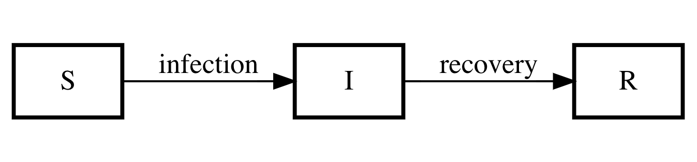

```{r setup, include=FALSE}
knitr::opts_chunk$set(echo = FALSE)
library(deSolve)
library(tidyverse)
library(ggformula)
library(patchwork)
library(phaseR)
library(latex2exp)
theme_set(theme_light())
```

# Goals

After reading this section of notes, you should

1) know what is the basic SIR model, and

2) have a sense of how the SIR model may be extended to incorporate other features  relevant to understanding the spread of infectious diseases. 


# Overview

The use of mathematical models, and differential equations specifically to understand the spread of infectious diseases dates back at least to the 18th century. (See [@bacaerShortHistoryMathematical2011; @bjornstadEpidemicsModelsData2018; @brittonEssentialMathematicalBiology2003; @hadelerTopicsInMathBio2017] for more aspects of the historical development of mathematical epidemiology.) However, the modern approach, an approach which is frequently used to this day, to mathematical epidemiology begins in [@kermackContributionMathematicalTheory1927]. Two things that are quite interesting about this paper are

1) the authors clearly state a fundamental question about epidemics in a way that lends to a quantitative study, and 

2) the authors write down a simple differential equations model now widely known as the SIR model. This SIR model corresponds to a compartment model and forms the basis for a lot of research in biomathematics. 

The basic idea of the SIR model is to divide a population into distinct classes of individuals that are susceptible to infection, individuals that are infected, and individuals that have recovered and become immune to infection. To point 1, in [@kermackContributionMathematicalTheory1927], the authors write

> In the course of time the epidemic may come to an end. One of the most important problems in epidemiology is to ascertain whether this termination occurs only when no susceptible individuals are left, or whether the interplay of the various factors of infectivity, recovery and mortality, may result in termination, whilst many susceptible individuals are still present in the unaffected population.
Hence, our problem is to understand what proportion of a population becomes infected and how quickly this occurs. Given this knowledge, we can formulate better strategies for combating epidemics. Mathematical models are useful in this regard as well since we can modify the model by incorporating terms that correspond to a mitigation strategy.

In the next section, we will introduce the SIR model as a compartment model,  our primary reference is Chapter 6 from [@hadelerTopicsInMathBio2017].

# Initial SIR Model 

We begin by considering an infectious disease like chickenpox or the annual flu over a relatively short period of time, say for example a single flu season. This will allow us to make the following simplifying assumptions:

1) We have a homogeneous population and can reasonably ignore birth and death processes.
2) The infection does not cause mortality. 
3) Infection of susceptibles occurs via contact with infecteds. We assume that infected individuals are mixing with others in the population in a random and independent fashion. 
4) There is no latent period of infection. 
5) Chances of recovery does not change during the course of infection.
6) Infectiousness does not change during the course of infection.

The following compartment diagram corresponds to (aspects of) our model assumptions. 

```{r fig1, echo=FALSE, fig.cap="SIR compartment model for the spread of infectious disease.", out.width = '70%'}

```

If we let $\beta$ be the rate of infection of  susceptibles per number of infected, and if we let $\gamma$ be the recovery rate, then the differential equations corresponding to the compartment diagram are:

\begin{align}
\frac{dS}{dt} &= -\beta SI, \\
\frac{dI}{dt} &= \beta SI - \gamma I, \\
\frac{dR}{dt} &= \gamma I. 
\end{align}

Let's make two notes regarding the model system. 

1) The infection rate term $\beta SI$ is mathematically the same as [the law of mass action](https://en.wikipedia.org/wiki/Law_of_mass_action). We will see this again when we study chemical reaction models later in the course. This "mass action" in the context of the SIR model can be justified with probabilistic arguments. Notice that if there are no infected individuals, then no susceptible will ever become infected. This is a reasonable fact. 

2) If we add the three equations, we obtain $\frac{dS}{dt}+\frac{dI}{dt}+\frac{dR}{dt}=0$. So, if $N=S+I+R$ is the total population, we have that $\frac{dN}{dt}=0$ which implied that the total population is constant in time. 

What can we learn from the SIR model? Once we have developed some more mathematical tools we will be able to learn quite a lot from the SIR model equations. For now, let's look at the plot of solutions to the SIR equations under two different scenarios. 

Observe that in the previous equations, the $R$ equation decouples from the $S$ and $I$ equations. Thus, it suffices to remove it from an analysis. 

## Numerical Simulations

We can obtain numerical solutions to the SIR model equations using the `deSolve` package in R. In a later lecture we will explain in detail how to use the `deSolve` package. In the following results, we display the graphs for the susceptible and infected populations as functions of time. Two different situations are shown. 

```{r,echo=TRUE,fig.width=12,fig.height=6}
sir_model <- function(t,state,parameters){
  with(as.list(c(state,parameters)),{
    dx <- -R0*x*y
    dy <- R0*x*y - y
    
    list(c(dx,dy))
  })
}
state <- c(x=0.90,y=0.1)
times <- seq(0,15,by=0.1)
sim1 <- as.data.frame(ode(y=state,times=times,func=sir_model,parms=c(R0=0.8)))
sim2 <- as.data.frame(ode(y=state,times=times,func=sir_model,parms=c(R0=5.6)))
p1 <- sim1 %>% rename(susceptible=x,infected=y) %>% 
  pivot_longer(cols=c(susceptible,infected),names_to="state",values_to="population") %>%
  ggplot(aes(x=time,y=population,color=state)) + geom_line(lwd=2,show.legend = FALSE) + ylim(c(0,1)) + 
  labs(x="time",title="Susceptibles persist") +  theme(text = element_text(size = 20)) 
p2 <- sim2 %>% rename(susceptible=x,infected=y) %>% 
  pivot_longer(cols=c(susceptible,infected),names_to="state",values_to="population") %>%
  ggplot(aes(x=time,y=population,color=state)) + geom_line(lwd=2) + ylim(c(0,1)) +
  labs(x="time",y="",title="Susceptibles diminish") +  theme(text = element_text(size = 20)) 
(p1 | p2)
```

In the plot on the left, only a small proportion of susceptible individuals become infected and in the long term, "many susceptible individuals are still present in the unaffected population" as the authors say in [@kermackContributionMathematicalTheory1927]. On the other hand, the right side plot shows the spread of an infection such that little to no susceptible individuals remain uninfected. 

What is happening that leads to this distinct qualitative (and quantitative)  difference in the outcome for the spread of the infection? After discussing dimensional analysis, we will show that there is a single numerical quantity, the magnitude of which very specifically determines the spread of the infection. This number is called [$R_{0}$](https://en.wikipedia.org/wiki/Basic_reproduction_number). 

There are many common variations on the basic SIR model. Some of these attempt to include the effects such as a latent infection period, age-dependent infection rates, the spatial spread of infections, etc. We will consider some further epidemiological models later in the course. You are also invited to explore the literature on your own perhaps as part of your final project. 

## Incorporating Vaccination

A key application of SIR-type models is to study epidemic mitigation strategies. Two common strategies for limiting the spread of an infectious disease are vaccination and quarantine. Let's consider how the basic SIR model could be modified to incorporate vaccination. We examine a scenario in which vaccination is implemented at the onset of a disease outbreak. 

What component(s) of the SIR model needs to be changed? Assume that the role of vaccination is to prevent infection of some proportion of susceptible individuals thus "moving" some susceptibles directly to the recovered on removed state. This can be modeled via  a function $\psi$ that depends on the number of susceptible and infected individuals resulting in 

\begin{align}
\frac{dS}{dt} &= -\beta SI - \psi(S,I), \\
\frac{dI}{dt} &= \beta SI - \gamma I, \\
\frac{dR}{dt} &= \gamma I + \psi(S,I). 
\end{align}

**Reflections:** Why should $\psi$ depend on both the number of susceptible and infected individuals? What do you think will be the impact of vaccination compared with the results fomr our numerical simulations using the base SIR model? 

The questions remains as to exactly is an appropriate expression for the function $\psi$? What would you propose initially? When we discuss functional forms later in the course we will return to a discussion on this question. 


## The Role of Quarantines 

The quarantine strategy differs from the vaccination strategy from a modeling perspective in that it introduces a new compartment into the $S \rightarrow I \rightarrow R$ scheme. At least some infected individuals are placed into quarantine before eventually moving into the recovered state. 

**Exercise:** Draw an appropriate compartment diagram for an SIR-type model that incorporates quarantine.   

If we let the total population be $N=S+I+Q+R$, where $Q$ denotes the number of individuals in quarantine, then one SIR-type model incorporating quarantine is

\begin{align}
\frac{dS}{dt} &= -\beta \frac{SI}{N-Q}, \\
\frac{dI}{dt} &= \beta \frac{SI}{N-Q} - \gamma I -\kappa I, \\
\frac{dQ}{dt} &= \kappa I - \sigma Q, \\
\frac{dR}{dt} &= \gamma I + \sigma Q. 
\end{align}

**Question:** Do these model equations correspond to the compartment diagram you came up with? 

**Exercise:** Explain in words the meaning of the terms in the last set of equations. 

We will study the model with quarantine in more detail later in the course. If you want to explore more about infections disease modleing, the following section provides a list of sources to get you started.  

# Further Reading

The recent article [@artzrouniAreModelsUseful2020] provides an excellent and elementary exposition of epidemiological models including SIR. This paper discusses, along with some basic principles of mathematical modeling, the usefulness of models for understanding the recent [COVID-19](https://en.wikipedia.org/wiki/Coronavirus_disease_2019) pandmeic. This article is highly recommended and will be assigned reading a little later in the course.   

Some textbooks that contain substantial coverage of epidemiological modeling include [@bjornstadEpidemicsModelsData2018; @brauerMathematicalModelsPopulation2012; @brittonEssentialMathematicalBiology2003], the textbook on mathematical modeling, [@calvettiComputationalMathematicalModeling2013], introduces the basic SIR model. A nice introduction to stochastic models for the spread of infectious disease may be found in [@allenIntroductionStochasticProcesses2011].

The research literature on mathematical epidemiology is vast. Some accessible papers that extend what we cover on epidemiological models in this class are [@hethcoteMathematicalModelsSpread1975; @hethcoteMathematicsInfectiousDiseases2000; @hethcoteThreeBasicEpidemiological1989]. Other interesting papers include [@hethcotePeriodicityEpidemiologicalModels1989; @ruanDynamicalBehaviorEpidemic2003; @schafferNearlyOnedimensionalDynamics1985; @vandendriesscheReproductionNumbersSubthreshold2002].
