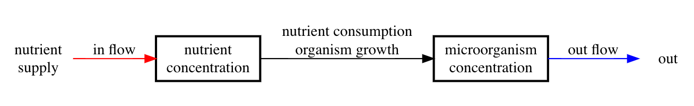

```{r setup, include=FALSE}
knitr::opts_chunk$set(echo = FALSE)
library(deSolve)
library(tidyverse)
library(ggformula)
library(patchwork)
library(phaseR)
library(latex2exp)
theme_set(theme_light())
```

# Goals

After reading this section of notes, you should

1) know what a chemostat is, and

2) know the basic mathematical model corresponding to the chemostat. 


# Overview

A [chemostat](https://en.wikipedia.org/wiki/Chemostat) is an experimental apparatus that can be used to culture microorganisms in a controlled fashion. A chemostat is set up to allow one to pump a sterile nutrient into the growth chamber of the apparatus at a constant rate, keeping the volume within the growth chamber constant by allowing excess medium to flow out. From an ecological point of view, the chemostat is interesting because it provides insight into the carrying capacity. For our purposes, we will use the chemostat as motivation for a discussion on functional forms (to be defined later) and reaction kinetics. Finally, the chemostat is a topic of interest in much of the research literature in biomathematics, see for example [@butlerBifurcationLimitCycle1981; @butlerMathematicalModelChemostat1985; @butlerMathematicalModelChemostat1985a; @nowackExclusionTemporallyVarying2018; @smithTheoryChemostat1995]. An introduction to the chemostat along the lines of what we do in these notes can be found in any of [@allenIntroductionMathematicalBiology2007; @edelstein-keshetMathematicalModelsBiology2005; @kotElementsMathematicalEcology2001]. 

Before we develop a mathematical model for the chemostat it is helpful to see what one looks like. Good illustrations can be found at the [Wikipedia page for chemostat](https://en.wikipedia.org/wiki/Chemostat) or at [this image link](https://images.app.goo.gl/NEY7zuNu2bywjqZE6).

# The Chemostat Model

The chemostat possesses the following features that we can exploit to develop a mathematical model for the nutrient limited growth of an organism:

1) There is a regular supply of nutrient of constant concentration $C_{0}$ that is pumped into the growth chamber at a volumetric flow rate $F$. 

2) The growth chamber is kept at constant volume $V$. 

3) After being well-mixed with nutrient in the growth chamber, any excess nutrient and biomass are removed at a volumetric flow rate $F$. 

4) The growth rate of the microorganism is a function of the concentration of nutrient within the growth chamber. 

We can represent this using a compartment modeling approach. 

The following compartment diagram corresponds to (aspects of) our model assumptions. 

```{r fig1, echo=FALSE, fig.cap="Chemostat compartment model for nutrient limited growth of a microorgansim.", out.width = '80%'}

```

Let $C(t)$ be the concentration of nutrient in the growth chamber at time $t$ and let $N(t)$ be the concentration of microorganism in the growth chamber at time $t$. The nutrient mass $VC(t)$ and microorganism biomass $VN(t)$ must be conserved. Thus, a balance law leads to the following system of differential equations:

\begin{align}
\frac{dVN}{dt} &= G(C)VN - FN,  \\
\frac{dVC}{dt} &= FC_{0} - \alpha G(C)VN - FC,
\end{align}

or equivalently

\begin{align}
\frac{dN}{dt} &= G(C)N - \frac{F}{V}N,  \\
\frac{dC}{dt} &= \frac{F}{V}C_{0} - \alpha G(C)N - \frac{F}{V}C.
\end{align}

In the previous system of equations, the function $G(C)$ is the nutrient limited growth rate for the microorganism and $\alpha$ is a constant of proportionality. We do not know *a priori* the exact manner in which the growth rate will depend on the nutrient concentration. A particular choice for $G(C)$ is an example of what we call a **functional form**. Thus, in order to complete our mathematical modeling we need to specify a functional form for $G$. One of the perennial challenges of mathematical modeling is to choose an appropriate functional form for a term or terms in a mathematical model.  

There is one clear property that we know the function $G$ must satisfy, that is $G(0)=0$. This represents an extreme situation and it is often helpful to consider extreme situations in order to motivate constraints that need to be placed on a functional form. Another type of extreme is asymptotic behavior. For example, what do we expect about $\lim_{C \rightarrow \infty}G(C)$? 

When thinking about functional forms, we may also want to consider qualitative behaviors such as increasing/decreasing behavior, concavity, etc. For example, it seems reasonable to assume that the nutrient limited growth rate function $G(C)$ is increasing. As a simple first approximation, we could choose $G(C)$ to be a linear function, then we would have the following model system: 

\begin{align}
\frac{dN}{dt} &= aCN - \frac{F}{V}N,  \\
\frac{dC}{dt} &= \frac{F}{V}C_{0} - \alpha aCN - \frac{F}{V}C.
\end{align}

Later we will analyze this previous system of equations in order to see what type of behavior is predicted. For now, consider the following: a consequence of assuming $G(C)=aC$ is that $\lim_{C \rightarrow \infty}G(C) = \infty$. Do you think that this is an accurate reflection of reality? Why or why not? Might it be more realistic to have $\lim_{C \rightarrow \infty}G(C) = L$ for some constant value $L$? All of these questions are addressed in detail in the next lecture.  


# Further Reading 

As noted already, an introductory treatment of the chemostat may be found in any of [@allenIntroductionMathematicalBiology2007; @edelstein-keshetMathematicalModelsBiology2005; @kotElementsMathematicalEcology2001] as well as the online lecture notes by [Sontag](https://www.math.rutgers.edu/docman-lister/math-main/academics/undergraduate/interdisciplinary-majors/biomathematics-interdisciplinary-major/2198-lecture-notes-on-mathematical-systems-biology/file). 

To get a sense of what type of problems and applications are associated with the chemostat in research, a good place to start is with one or more of the following [@butlerBifurcationLimitCycle1981; @butlerMathematicalModelChemostat1985; @butlerMathematicalModelChemostat1985a; @nowackExclusionTemporallyVarying2018; @smithTheoryChemostat1995].

