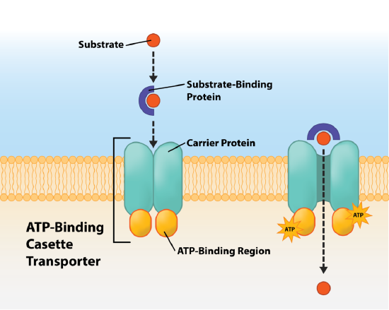
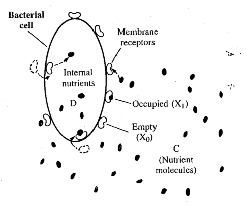

```{r setup, include=FALSE}
knitr::opts_chunk$set(echo = FALSE)
library(deSolve)
library(tidyverse)
library(ggformula)
library(patchwork)
library(phaseR)
library(latex2exp)
theme_set(theme_light())
```

# Goals

After reading this section of notes, you should

1) appreciate the concept of a functional form, and

2) know the type I, II, and III functional forms and some of their properties.

# Overview
 
 Recall the differential equations for our mathematical model of the chemostat:
 
 \begin{align}
\frac{dN}{dt} &= G(C)N - \frac{F}{V}N,  \\
\frac{dC}{dt} &= \frac{F}{V}C_{0} - \alpha G(C)N - \frac{F}{V}C.
\end{align}

In order for this model to be useful, we need to obtain an explicit expression, or a **functional form** for the nutrient dependent growth rate function $G(C)$.  Further, recall our discussion on incorporating vaccination into the basic SIR model. This led to the following system of equations:

\begin{align}
\frac{dS}{dt} &= -\beta SI - \psi(S,I), \\
\frac{dI}{dt} &= \beta SI - \gamma I, \\
\frac{dR}{dt} &= \gamma I + \psi(S,I). 
\end{align}

To apply this model, we need an appropriate functional form for $\psi$.  

In these notes we address this and begin a larger discussion of some functional forms that occur commonly in mathematical biology. Before doing that, as additional motivation, let's look at two more modeling situations that require further consideration regarding the specification of a functional form. 

Remember that for a time-dependent population $N(t)$, we refer to the quantity $\frac{1}{N}\frac{dN}{dt}$ as the per-capita rate of growth. A differential equation model for the growth of a population may be obtained by specifying a functional form for the per-capita rate of growth $F(N)$, since then we obtain 

$\frac{1}{N}\frac{dN}{dt}=F(N),$

or equivalently 

$\frac{dN}{dt}=NF(N).$

Once an explicit expression is given for $F(N)$, the behavior of the growth of the population can be explored by analyzing the differential equation $\frac{dN}{dt}=NF(N)$. We have already seen two examples of this, one where $F(N) = r$, a constant, and another where $F(N) = r\left(1 - \frac{N}{K}\right)$.   

Further, many differential equation models for predator-prey interactions take the form

\begin{align}
\frac{dU}{dt} &= rU\left(1-\frac{U}{K}\right) - V\Phi(U),  \\
\frac{dV}{dt} &= \alpha V\Phi(U) - \beta V.
\end{align}


In these equations, $U$ is the prey population and $V$ is the predator population.  The function $\Phi(U)$ is called the **predator functional response.** To complete the last system of differential equations and apply them to a particular situation, we need an explicit expression for $\Phi(U)$. 

**Exercise:** Provide an explanation for the meaning of $\Phi(U)$ in the previous equations.

For a mathematical model, how does one determine an appropriate functional form? Unfortunately, there is no universal principle or general technique for determining functional forms. This should not be too much of a surprise given the fact that there are infinitely many functions to choose from. Then how do we solve the seemingly impossible problem of selecting functional forms? The answer is through a mix of examples, experience, intuition, careful reasoning, and hard work. 

# Some Common Functional Forms

In this section, we list a few functional forms that occur frequently in the mathematical biology literature. In fact, the functional forms that we list here are so common that they have names associated with them, at least when they occur in the context of mathematical ecology. The functional forms to which we are referring are: 

1) Holling Type I - $f(x) = a x$, 
2) Holling Type II - $f(x) = \frac{ax}{b + x}$, and
3) Holling Type III - $f(x) = \frac{ax^2}{b^2 + x^2}$. 

Notice that all three of the previous functions are increasing functions of $x$ on $(0,\infty)$ (we assume that the parameters $a$ and $b$ are positive). In the homework, you will explore important qualitative differences between the three Holling type functional forms. For reasons that we will see later, the Holling Type II functional response is also sometimes called a **Michaelis-Menten** response. Let's examine a situation where a Holling Type II functional response arises as an appropriate choice for a functional form in a mathematical model. 


# Michaelis-Menten Form in the Chemostat Model

In this section, we follow the presentation from [@edelstein-keshetMathematicalModelsBiology2005] to look at an example in which a Holling Type II, or Michaelis-Menten functional form arises naturally. (See also the online notes by [Sontag](http://www.sontaglab.org/FTPDIR/systems_biology_notes.pdf).) 

In order to derive an appropriate functional form for the nutrient dependent rate of growth $G(C)$ in the chemostat model, let's look in more detail at the biochemical processes involved in cellular consumption of a nutrient substance like glucose. We view the nutrient as a [substrate](https://en.wikipedia.org/wiki/Substrate_(chemistry)) molecule that will bind with [receptor proteins](https://en.wikipedia.org/wiki/Receptor_(biochemistry)) at the surface membrane of the cell. The molecular receptors at the cell membrane capture nutrient molecules and then transport the resulting nutrient/receptor complex through the membrane and then finally release the nutrient into the cell body. This is necessary since water-soluble molecules are unable to permeate the cell membrane. Figure \@ref(fig:membrane) illustrates the process.  

Nutrient transport at cell membrane (from [Biology LibreTexts](https://images.app.goo.gl/HFugV2ukjkXzaWVy5))

```{r membrane, echo=FALSE, fig.cap='Nutrient transport at cell membrane (from [Biology LibreTexts](https://images.app.goo.gl/HFugV2ukjkXzaWVy5)).', out.width = '50%'}

```


Now, once the nutrient is released  into the cell body, the membrane receptor is free again to bind with another nutrient molecule. This results in a sort of "conveyor-belt" procedure. However, when a cell is "surrounded by" nutrient as is the case in a chemostat, there is usually a much greater concentration of available nutrient than there is unbound membrane receptor proteins, a situation illustrated in Figure \@ref(fig:transport). The result is a "saturation effect" due to the limited number of available receptors, an important observation that we will return to soon. 

```{r transport, echo=FALSE, fig.cap='The conveyor belt model from [@edelstein-keshetMathematicalModelsBiology2005].', out.width = '40%'}

```

If we denote the external nutrient by $C$, unoccupied receptors by $X_{0}$, an occupied receptor by $X_{1}$, and a nutrient molecule successfully transported in the cell body by $P$, then the scenario described above and represented in Figure \@ref(fig:transport) can be written as a chemical reaction:
\begin{align}
&\ce{C + X_0 <=>[k_{1}][k_{-1}] X_1}\\
&\ce{X_1 ->[k_{2}] P + X_0 }
\end{align}


Notice that the first reaction is **reversible** while the second is **irreversible**. Basically this says that a molecule of $C$ binds with an unoccupied receptor $X_{0}$ to form a complex $X_{1}$ which results in a product $P$ of transported nutrient and a free receptor $X_{0}$. The rate of these reactions are specified by constants $k_{1}$ (first forward reaction), $k_{-1}$ (first reverse reaction) and $k_{2}$ (second forward reaction). The **rate constants** are essentially constants of proportionality that describe how likely the reactions are to result in the specified products. 

To convert the chemical equations into differential equations for the rate of change of the concentration of the molecules involved we apply the  **law of mass action** which states that when two or more reactants are involved in a reaction step, the rate of reaction is proportional to the product of their concentrations. (Note the similarity with what we saw in the SIR model.)  Following a commonly used convention, we denote the concentrations of molecules $C$, $X_{0}$, $X_{1}$ and $P$ by the corresponding lower-case letters $c$, $x_{0}$, $x_{1}$, and $p$ respectively. The law of mass action then gives

\begin{align}
  \frac{dc}{dt} & = -k_{1}cx_{0} + k_{-1}x_{1},\label{eq:MM1a} \\
  \frac{dx_{0}}{dt} & = -k_{1}cx_{0} + k_{-1}x_{1} + k_{2}x_{1}, \label{eq:MM1b} \\
  \frac{dx_{1}}{dt} & = k_{1}cx_{0} - k_{-1}x_{1} - k_{2}x_{1}, \label{eq:MM1c} \\
  \frac{dp}{dt} & = k_{2}x_{1}.  \label{eq:MM1d}
\end{align}

Again,  note that the law of mass action is analogous to deriving models for the spread of an infectious disease, where we assumed that the rate in which susceptibles become infected is proportional to the product of susceptible and infected. Using the law of mass action to derive differential equations for chemical reactions is fundamental to research in biochemistry and systems biology, this is something we will return to again later. 

How does this lead us to a Holling Type II functional response? We need to do a little more work to get there. Specifically, we want to simplfy the last set of equations which we can begin to do by observing that

1) the last equation is decoupled from the others since $p$ does not appear in any of the first three equations, and 

2) even more importantly, we can add up the second and third equation to obtain $\frac{dx_{0}}{dt} + \frac{dx_{1}}{dt}=0$ which imples that $x_{0}+x_{1} = \text{constant}$. For notational purposes, set $x_{0}+x_{1}=r$. (Note again how there is an analog with the SIR model.)

By solving for one of $x_{0}$ or $x_{1}$ in terms of the other, we can eliminate another differential equation. Let us write $x_{0} = r - x_{1}$ and substitute this into our equations  to obtain
\begin{align}
  \frac{dc}{dt} & = -k_{1}c(r - x_{1}) + k_{-1}x_{1} = -k_{1}rc + (k_{-1} + k_{1}c)x_{1},\label{eq:MM2a} \\
  \frac{dx_{1}}{dt} & = k_{1}c(r - x_{1}) - k_{-1}x_{1} - k_{2}x_{1} = k_{1}rc - (k_{-1} + k_{2} + k_{1}c)x_{1}. \label{eq:MM2b}
\end{align}

Let's reflect on what these equations model. They tell us the rate of change of the concentrations of the nutrient ($c$) and of the bound cell membrane receptors ($x_{1}$). At this point, we have reduced a system of four ODEs to an equivalent system of two. However, there is one additional simplification that can be made and this is where our intuition plays an important role. 

As we mentioned previously and as illustrated in Figure 2, we expect that there is far more available nutrient than there are available receptors. Thus, we assume that $x_{0}$ will very quickly reach zero and hence $x_{1}$ will very quickly reach a steady-state value $r$. In other words, it is very reasonable to assume that $\frac{dx_{1}}{dt} = 0$, an assumption known as the **quasi-steady-state assumption**, which reduces the last two differential equations further to
\begin{align}
  \frac{dc}{dt} & = -k_{1}c(r - x_{1}) + k_{-1}x_{1} = -k_{1}rc + (k_{-1} + k_{1}c)x_{1},\label{eq:MM3a} \\
   0 & = k_{1}c(r - x_{1}) - k_{-1}x_{1} - k_{2}x_{1} = k_{1}rc - (k_{-1} + k_{2} + k_{1}c)x_{1}, \label{eq:MM3b}
\end{align}
one differential equation and one algebraic equation. Using some algebra, we can solve the equation 

$k_{1}rc - (k_{-1} + k_{2} + k_{1}c)x_{1} = 0$

for $x_{1}$. Specifically, 

$x_{1} = \frac{k_{1}rc}{k_{-1}+k_{2} + k_{1}c} = r \frac{c}{\left(\frac{k_{-1}+k_{2}}{k_{1}}\right) + c},$

an expression that shoud remind you of a Holling Type II functional form. The quasi-steady-state hypothesis can actually be put on a more firm mathematical foundation by using techniques from [singular perturbation theory](https://en.wikipedia.org/wiki/Singular_perturbation), a topic that we will discuss a bit later in the course. If we substitute the identity, 

$x_{1} = r \frac{c}{\left(\frac{k_{-1}+k_{2}}{k_{1}}\right) + c}$

into the last equation for $\frac{dc}{dt}$, we obtain 

\begin{align}
  \frac{dc}{dt} &= -k_{1}rc + (k_{-1} + k_{1}c)r \frac{c}{\left(\frac{k_{-1}+k_{2}}{k_{1}}\right) + c} \\
  &= rc\left[\frac{-k_{1}\left[\left(\frac{k_{-1}+k_{2}}{k_{1}}\right) + c\right] + k_{-1} k_{1}c}{\left(\frac{k_{-1}+k_{2}}{k_{1}}\right) + c} \right] \\
  &= rc\left[ \frac{-k_{-1}-k_{2} - k_{1}c + k_{-1} + k_{1}c}{\left(\frac{k_{-1}+k_{2}}{k_{1}}\right) + c} \right] \\
  &= rc\left[ \frac{-k_{2}}{\left(\frac{k_{-1}+k_{2}}{k_{1}}\right) + c} \right] \\
  &= -k_{2}r\frac{c}{\left(\frac{k_{-1}+k_{2}}{k_{1}}\right) + c}
\end{align}


Now define $K_{\text{max}} = k_{2}r$ and $k_{n} = \frac{k_{-1} + k_{2}}{k_{1}}$, then we can write the above result as
\begin{align}
  \frac{dc}{dt} = -\frac{K_{\text{max}}c}{k_{n} + c}, \label{eq:MMratelaw}
\end{align}
which is commonly referred to as the **Michaelis-Menten** rate law. What this says is that the consumption rate of the nutrient is proportional to the function of the form
\[ f(c) = K_{\text{max}}\frac{c}{k_{n} + c}, \]
a Michaelis-Menten function or a Holling Type II functional form.

In order to get a better understanding of the Holling Type II functional response, let's look at the graph of the function $f(x) = \frac{x}{1+x}$. 


```{r,code_folding=TRUE}
F <- function(x){x/(1+x)}
x <- seq(0,3,by=0.01)
df <- tibble(x=x)
ggplot(df,aes(x)) + geom_function(fun=F,lwd=1) + labs(x="x",y=TeX("$f(x) = \\frac{x}{1+x}$"),title="Shape of the graph of Holling Type II")
```


Note that the graph of any Holling Type II functional form will have the same shape as the previous graph. 

You may be wondering what is the meaning of the parameters $K_{\text{max}}$ and $k_{n}$ in the function $f(c) = K_{\text{max}}\frac{c}{k_{n} + c}$. Well, $K_{\text{max}}$ is the limit of $f(c)$ as $c\rightarrow \infty$. You can think of  $K_{\text{max}}$ as the theoretical maximum rate of consumption. Next, notice that

$f(k_{n}) = \frac{K_{\text{max}}}{2}.$

Thus, $k_{n}$ is the concentration level at which the rate of consumption is exactly half of the theoretical maximum rate of consumption. No matter how much nutrient is available, a cell can never consume at a rate greater than $K_{\text{max}}$, this encapssulates the saturation effect we have been hinting at. There is a common method for estimating the values of $K_{\text{max}}$ and $k_{n}$ given appropriate data. This method arises from the following observation:

$\frac{1}{f(c)} = \frac{k_{n} + c}{K_{\text{max}}c} = \frac{k_{n}}{K_{\text{max}}}\frac{1}{c} + \frac{1}{K_{\text{max}}}.$

The previous expression is a linear equation in $\frac{1}{c}$ with slope $\frac{k_{n}}{K_{\text{max}}}$ and $y$-intercept $\frac{1}{K_{\text{max}}}$.  The point is, if we have date for the rate $\frac{dc}{dt}$ and the concentrations $c$, then the relation 

$-\frac{1}{\frac{dc}{dt}} = \frac{k_{n}}{K_{\text{max}}}\frac{1}{c} + \frac{1}{K_{\text{max}}}$

allows us to  estimate $K_{\text{max}}$ and $k_n$. 


# The Spruce Budworm Model 

In this section, we look at an example in which a Holling Type III functional form arises naturally.  Whenever a functional form is expected to increase as a function of its input but with a saturating characteristic one might be inclined to try a Holling Type II functional response. This is good thinking but there may be additional features at play that should be taken into account. There is a well-known problem that illustrates the point we are getting at here. The spruce budworm model seeks to study the outbreak of an insect known as the [spruce budworm](https://en.wikipedia.org/wiki/Choristoneura) that is considered a pest due to the negative impact these insects can have on a tree population. The mathematical model attempts to capture the population growth of the budworm assuming logistic growth and predation. The general form for the mathematical model is

$\frac{dN}{dt} = rN\left(1 - \frac{N}{K}\right) - p(N),$

where $p(N)$ is the death rate due to predation (mainly by birds) of the insect. It is natural to assume that $p(N)$ saturates because birds can only eat so many budworms. On the other hand, since the relevant birds eat more than just the budworm, they will not expend a great deal of energy to seek out the budworm for predation unless there are sufficiently many budworms available. In other words, of $N$ is very near zero, one expects that $p(N)$ should be relatively small. This is not a feature of a Holling Type II functional response but it is a feature of a Holling Type III response. To see this, let's graph $f(x)=\frac{x^2}{1+x^2}$ which is representative in terms of shape of  a Holling Type III response. 

```{r,code_folding=TRUE}
F <- function(x){x^2/(1+x^2)}
x <- seq(0,3,by=0.01)
df <- tibble(x=x)
ggplot(df,aes(x)) + geom_function(fun=F,lwd=1) + labs(x="x",y=TeX("$f(x) = \\frac{x^2}{1+x^2}$"),title="Shape of the graph of Holling Type II")
```

Note the change in concavity that occurs near 0.5. (In the homework you will be asked to determine the exact location of the inflection point.) 

Thus, using a Holling Type III functional response for $p(N)$, the spruce budworm model becomes

$\frac{dN}{dt} = rN\left(1 - \frac{N}{K}\right) - \gamma \frac{N^2}{1+N^2}.$

Later we will see that the the spruce budworm exhibits some interesting behavior. In particular, the sprice budworm model exhibits a [saddle-node  bifurcation](https://en.wikipedia.org/wiki/Saddle-node_bifurcation#:~:text=In%20the%20mathematical%20area%20of,collide%20and%20annihilate%20each%20other.).

# Further Reading 

We are not aware of any single reference that provides a general discussion of functional forms in biomathematics. However, an excellent exercise is to look at a few papers from the literature and pay close attention to what functional forms appear in models. You may also want to try to figure out why the authors have chosen to use the functional form that they employ. Some good places to start are:

1) the paper [@gerleeModelMuddleSearch2013] that considers a number of simple growth laws for a tumor population,

2) the recent paper [@alonsoizquierdoGeneralizedHollingType2019] that uses a modification of the Holling Type II response in a predator-prey type model, 

3) the previously mentioned paper [@heraldGeneralModelInflammation2010] on inflammation modeling, 

4) the paper [@khouryQuantitativeModelHoney2011] on honey bee populations, and

5) the paper [@butlerMathematicalModelChemostat1985a] which greatly expands our discussion of the chemostat model.