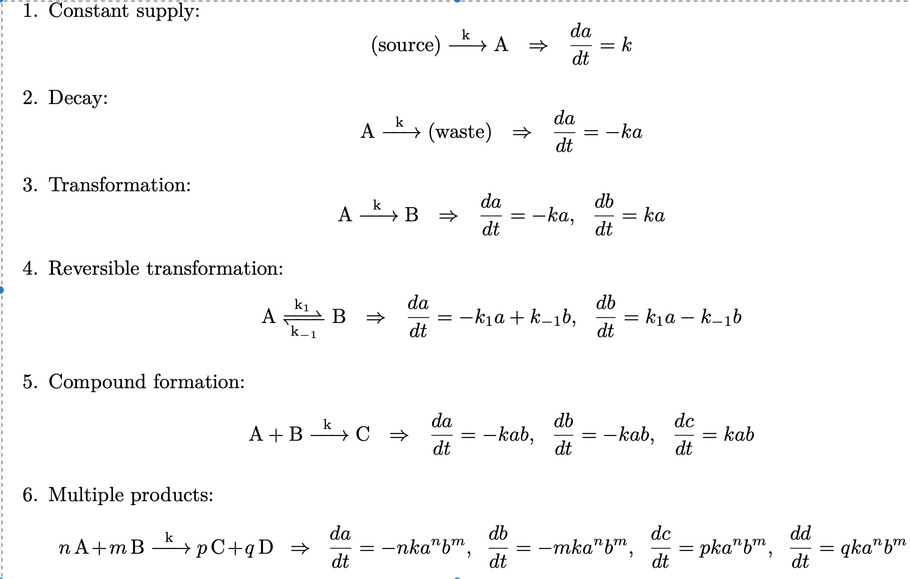

```{r setup, include=FALSE}
knitr::opts_chunk$set(echo = FALSE)
library(deSolve)
library(tidyverse)
library(ggformula)
library(patchwork)
library(phaseR)
library(latex2exp)
theme_set(theme_light())
```

# Goals

After reading this section of notes, you should

1) know the law of mass action and how it applies to derive differential equations models for reactions. 

# Overview

Molecular and cellular processes drive many biological phenomenon and thus should often be taken into consideration for mathematical modeling of biological problems. We have already seen an example of this in our mathematical modeling of the chemostat bioreactor. Recall that one of the steps in constructing a mathematical model for the chemostat was to develop a functional form for the nutrient dependent growth rate function. In order to do so, we considered what happens at the cellular level with regard to how a cell consumes nutrient. This led us to view the nutrient as a [substrate](https://en.wikipedia.org/wiki/Substrate_(chemistry)) molecule that will bind with [receptor proteins](https://en.wikipedia.org/wiki/Receptor_(biochemistry)) at the surface membrane of the cell, and in turn to the chemical reactions:

\begin{align}
&C + X_0 \rightleftharpoons X_1\\
&X_1 \rightarrow P + X_0 
\end{align}

where we denote the external nutrient by $C$, unoccupied receptors by $X_{0}$, an occupied receptor by $X_{1}$, and a nutrient molecule successfully transported in the cell body by $P$. From this we then applied the law of mass action (without really understanding what the law of mass action is) to derive a system of ordinary differential equations:

$$
\begin{align}
  \frac{dc}{dt} & = -k_{1}cx_{0} + k_{-1}x_{1}, (\#eq:MM1a) \\
  \frac{dx_{0}}{dt} & = -k_{1}cx_{0} + k_{-1}x_{1} + k_{2}x_{1}, (\#eq:MM1b) \\
  \frac{dx_{1}}{dt} & = k_{1}cx_{0} - k_{-1}x_{1} - k_{2}x_{1}, (\#eq:MM1c) \\
  \frac{dp}{dt} & = k_{2}x_{1}.  (\#eq:MM1d)
\end{align}
$$

for the rates of change in the concentrations of the relevant chemical species. 

In this section, we want to explain in more detail the process of translating a set of chemical reactions into differential equations that will form (perhaps just part of) a mathematical model. Specifically, this section spells out the law of mass action and some of its applications in more detail. 

We note that this section sets up a sort of template for some modeling approaches that are common in the field of [systems biology](https://en.wikipedia.org/wiki/Systems_biology). Excellent mathematical treatments of systems biology may be found in the online lecture notes of [Sontag](https://www.math.rutgers.edu/docman-lister/math-main/academics/undergraduate/interdisciplinary-majors/biomathematics-interdisciplinary-major/2198-lecture-notes-on-mathematical-systems-biology/file) or [Ingalls](https://www.math.uwaterloo.ca/~bingalls/MMSB/Notes.pdf). 

# Chemical Reaction Kinetics

The law of mass action is:

> Reaction rates are proportional to products of concentrations.

The law of mass action assumes conditions that include constant temperature. Furthermore, if the medium is not "well-mixed" or if there are only a small number of molecules involved then mass-action kinetics may not be accurate. 

This section describes how to apply the law of mass action to derive rate equations for a few common simple reactions that have the general form

\begin{equation}
  \text{reactants} \rightarrow \text{products} 
\end{equation}

Throughout this section, we make use of the following convention: Capital letters $A$, $B$, etc. will be used to denote a chemical species. This may be an ion or a complex molecule. We will use lower-case letters to denote the concentration of a chemical. For example, the concentration of chemical $A$ would be $a$. Thus, $\frac{da}{dt}$ would be the rate of change of the concentration of $A$ and $\frac{da}{dt}$ has unit dimensions of concentration per time.

We will follow Section 1.2 of [@witelskiMethodsMathematicalModelling2015] and list some of the more common basic chemical reaction models that occur in biomathematics and [systems biology](<https://en.wikipedia.org/wiki/Systems_biology>).

```{r fig1, echo=FALSE, fig.cap="Common basic chemical reaction models that occur in biomathematics.", out.width = '80%'}

```

Notice that the multiple products rule provides the correct way to deal with a reaction such as 

$$
 \begin{equation}
    A + A \rightarrow C = 2A \rightarrow C
\end{equation}
$$

Applying the multiple products rule gives
\begin{align*}
\frac{da}{dt} &= -2ka^2  \\
\frac{dc}{dt} &= ka^2
\end{align*}


We have seen, in the derivation of Michaelis-Menten kinetics in relation to the chemostat problem how the law of mass action is used to derive rate equations for a reaction that involves a single substrate (*e.g.*, a nutrient). This sections provides another illustration of the application of the law of mass action to a problem involving two substrates. Here the reaction scheme becomes

$$
\begin{align}
&C_{1} + C_{2} \rightleftharpoons C_{3}  \\
&C_{3} + C_{4} \rightleftharpoons  C_{5}  \\
&C_{5} \rightarrow C_{1} + C_{6} + C_{7}  
\end{align}
$$

The law of mass action then implies

$$
\begin{align}
\frac{dc_{1}}{dt} &= -k_{1}c_{1}c_{2} + k_{-1}c_{3} + k_{3}c_{5}  \\
\frac{dc_{2}}{dt} &=  -k_{1}c_{1}c_{2} + k_{-1}c_{3}  \\
\frac{dc_{3}}{dt} &=  k_{1}c_{1}c_{2}  - k_{-1}c_{3} - k_{2}c_{3}c_{4} + k_{-2}c_{5} \\
\frac{dc_{4}}{dt} &=  -k_{2}c_{3}c_{4} + k_{-2}c_{5} \\
\frac{dc_{5}}{dt} &=  k_{2}c_{3}c_{4} - k_{-2}c_{5} - k_{3}c_{5} \\
\frac{dc_{6}}{dt} &= k_{3}c_{5}  \\
\frac{dc_{7}}{dt} &= k_{3}c_{5}    
\end{align}
$$

Here, the analog of occupied receptors is $C_{3}$ and $C_{5}$ (why is this?). Thus, the quasi-steady-state assumption applied to this problem assumes that $c_{3}$ and $c_{5}$ quickly reach a steady-state so that $\frac{dc_{3}}{dt}=\frac{dc_{5}}{dt}\approx 0$. As a homework problem, you should solve the equations
\begin{align*}
0 &=  k_{1}c_{1}c_{2}  - k_{-1}c_{3} - k_{2}c_{3}c_{4} + k_{-2}c_{5} \\
0 &=  k_{2}c_{3}c_{4} - k_{-2}c_{5} - k_{3}c_{5} 
\end{align*}
for $c_{3}$ and $c_{5}$ and substitute the result into the equations for $c_{2}$ and $c_{4}$. Doing this should lead to a term of the form 

$v = \frac{V_{\text{max}}ab}{K_{AB} + K_{B}a + K_{A}b + ab},$

which is analogous to the Michaelis-Menten functional form in the case of a single substrate. 


# Further Reading

The presentation of the law of mass action and basic chemical reaction models given in this lecture closely follows that of Section 1.2 from [@witelskiMethodsMathematicalModelling2015].

We also recommend the lecture notes of [Sontag](https://www.math.rutgers.edu/docman-lister/math-main/academics/undergraduate/interdisciplinary-majors/biomathematics-interdisciplinary-major/2198-lecture-notes-on-mathematical-systems-biology/file) or [Ingalls](https://www.math.uwaterloo.ca/~bingalls/MMSB/Notes.pdf). In particular, Chapter 3 of Ingalls on biochemical kinetics derives a number of important mathematical models that are important in biochemical considerations.  Chapter 1 from [@keenerMathematicalPhysiologyVol2009a] develops the law of mass action from thermodynamic considerations and covers additional material beyond what is introduced in this course. The later chapters of [@keenerMathematicalPhysiologyVol2009a] show how biochemical reaction kinetics are used in mathematical modeling of problems in human physiology. 
