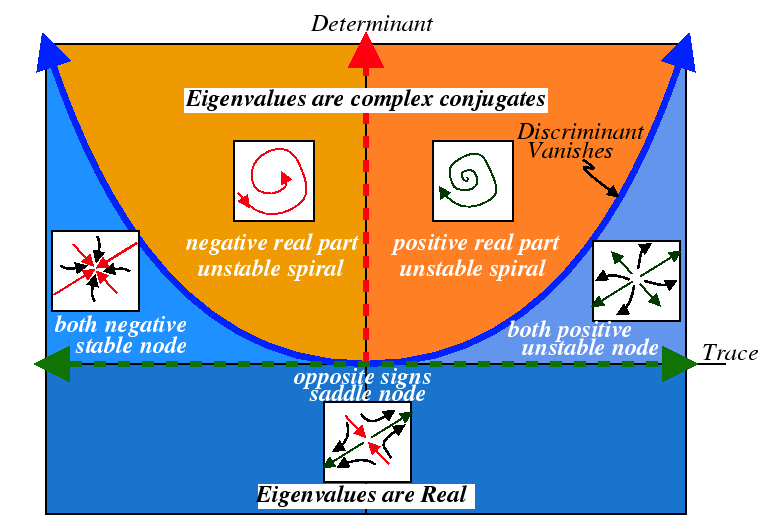

```{r setup, include=FALSE}
knitr::opts_chunk$set(echo = FALSE)
library(knitr)
library(kableExtra)
library(deSolve)
library(tidyverse)
library(ggformula)
library(patchwork)
library(phaseR)
library(latex2exp)
theme_set(theme_light())
```


# Goals

After reading this section of notes, you should

1) understand the trace-determinant classification of the qualitative behavior of dynamics for two-dimensional linear systems,

2) know how to use `phaseR` to obtain phase-portraits for two-dimensional linear systems, and

3) know how to compute numerical solutions for initial value problems for linear systems using `deSolve`.


# Background

Over the course of our discussions on mathematical modeling and models in biomathematics, we have encountered **systems** of coupled differential equations. For example, problems involving populations of interacting species and the study of the spread of infectious diseases resulted in systems of greater than one-dimension. Thus, we will take a short amount of time to review some mathematical techniques that are commonly used in the analysis or evaluation of biomathematical models. 

The simplest class of systems of coupled differential equations are linear constant-coefficient systems. Such systems have the form

$$
\frac{d}{dt}\left(\begin{array}{c} x_{1} \\ x_{2} \\ \vdots \\ x_{n}  \end{array}\right) = \left(\begin{array}{cccc} a_{11} & a_{12} & \cdots & a_{1n} \\ a_{21} & a_{22} & \cdots & a_{2n} \\ \vdots & \ddots & \cdots & \vdots \\ a_{n1} & a_{n2} & \cdots & a_{nn} \end{array}\right)\left(\begin{array}{c} x_{1} \\ x_{2} \\ \vdots \\ x_{n}   \end{array}\right)
$$

This can be written more succinctly if we use matrix-vector notation as

$$
\frac{d}{dt}{\bf x} = A {\bf x}
$$

where $A$ is an $n\times n$ matrix and ${\bf x}$ is an $n\times 1$ column vector. Note that such systems are **autonomous** because the right-hand-side does not depend explicitly on the independent variable $t$. Furthermore, if $\text{det}(A)\neq 0$, then the zero vector ${\bf 0}$ is a unique equilibrium for a linear system. When this is the case, it is possible to classify the dynamics of a linear system by examining it's eigenvalues and eigenvectors. The full details of this fact are beyond the scope of this course but we make the following observation: it is an easy exercise to show that if $\lambda$, ${\bf v}$ is an eigenvalue-eigenvector pair for the matrix $A$, then

$${\bf x}(t) = ce^{\lambda t}{\bf v}$$

where $c$ is any real number is a solution to the system $\frac{d}{dt}{\bf x} = A {\bf x}$. Further, a linear combination of solutions to a linear system is also a linear system. This is sometimes known as the principle of superposition. These observations suggest why it is possible to classify the dynamics of a linear system by examining it's eigenvalues and eigenvectors. 

We spend this time on the qualitative theory of linear systems because it is key to understanding the qualitative behavior of the dynamics of the types of nonlinear systems that arise frequently as biomathematical models. Thus, we proceed by looking in detail at the two-dimensional case.    

# The Trace-Determinant Plane

Consider a two-dimensional linear system 

$$
\frac{d}{dt}\left(\begin{array}{c} x_{1} \\ x_{2}  \end{array}\right) = \left(\begin{array}{cc} a_{11} & a_{12} \\ a_{21} & a_{22} \end{array}\right)\left(\begin{array}{c} x_{1} \\ x_{2} \end{array}\right)
$$

which for the remainder of this section we write as $\frac{d}{dt}{\bf x} = A {\bf x}$ with the understanding that $A$ is a $2\times 2$ matrix. Additionally, we will assume that $\text{det}(A)\neq0$ and hence that $A$ is nonsingular. In order to determine the eigenvalues for $A$, we must solve the characteristic polynomial

$$
0=\text{det}(A-\lambda I) = \text{det}\left(\begin{array}{cc} a_{11} - \lambda & a_{12} \\ a_{21} & a_{22}-\lambda \end{array}\right)=(a_{11}-\lambda)(a_{22}-\lambda)-a_{12}a_{21}
$$
which leads to $(a_{11}-\lambda)(a_{22}-\lambda)-a_{12}a_{21}=0$. We next demonstrate that this quadratic equation can by rewritten in terms of the trace $\tau=a_{11}+a_{22}$ and determinant $\delta=a_{11}a_{22}-a_{12}a_{21}$ of the matrix $A$. Specifically, 

$$
\begin{align}
(a_{11}-\lambda)(a_{22}-\lambda)-a_{12}a_{21} &= a_{11}a_{22}-a_{11}\lambda - a_{22}\lambda + \lambda^2 - a_{12}a_{21} \\
&= \lambda^{2} - (a_{11}+a_{22})\lambda + (a_{11}a_{22}- a_{12}a_{21}) \\
&= \lambda^{2} - \tau \lambda + \delta 
\end{align}
$$
We can now see that in the $2\times 2$ case, the characteristic polynomial $\text{det}(A-\lambda I) = \lambda^{2} - \tau \lambda + \delta = 0$ has solutions

$\lambda = \frac{\tau \pm \sqrt{\tau^2 - 4\delta}}{2}$

from which we determine that $A$ has 

1) two distinct real eigenvalues if $\delta > 0$ and $\tau^2 - 4\delta > 0$, 

2) a complex conjugate pair of eigenvalues if $\tau^2 - 4\delta < 0$ and $\tau \neq 0$, and 

3) pure imaginary eigenvlaues if $\delta > 0$ and $\tau = 0$. 

Furthermore, the eigenvalues of $A$ are

* both positive if $\tau > 0$, $\delta > 0$, and $\tau^2 - 4\delta > 0$, 

* both negative if $\tau < 0$, $\delta > 0$, and $\tau^2 - 4\delta > 0$

* one positive, one negative if $\delta < 0$

* complex conjugate pair if $\tau^2 - 4\delta < 0$ and $\tau \neq 0$, and

* pure imaginary if $\tau = 0$ and $\delta > 0$. 

Notice that in the case that $A$ has a complex conjugate pair of eigenvlaue, then $\tau$ determines the sign of the real part. Finally, the curve

$$
\delta = \frac{1}{4}\tau^2
$$
in the trace-determinant plane is the divider between real and complex eigenvalues. 

From a course in differential equations, we recall that for a two-dimensional system, the origin ${\bf 0}$ is classified as

* a stable node if both eigenvalues are negative, 

* an unstable node if both eigenvalues are positive, 

* a saddle if one eigenvalue if positive and one is negative, 

* a stable spiral if the eigenvalues are complex conjugate with negative real part, 

* an unstable spiral if the eigenvalues are complex conjugate with positive real part, and

* a center if the eigenvalues are pure imaginary. 


This is summarized graphically in Figure \@ref(fig:tracedetplane):

<aside>
This figure is linked from [Pruffle](http://pruffle.mit.edu/3.016-2005/Lecture_25_web/node2.html).
</aside>

```{r tracedetplane, echo=FALSE, layout="l-body-outset", fig.width=1.5, fig.height=1.5, fig.cap="Trace-determinant plane classification of two-dimensional linear systems. Image from [Pruffle](http://pruffle.mit.edu/3.016-2005/Lecture_25_web/node2.html)."}

```


Thus, the values of the trace $\tau$ and determinant $\delta$ completely specify the qualitative behavior of the dynamics for a two-dimensional linear system. Let us examine some examples. In each case, we use R to compute the trace, determinant, and eigenvalues of the $2\times 2$ matrix; and we use `phaseR` to plot the corresponding phase portrait. 

## Examples

We code a general linear system in R as

```{r linsys,echo=TRUE}
lin_sys <- function(t,state,parameters){
  with(as.list(c(state,parameters)),{
    
    dx <- A %*% state
    
    list(dx)
  })
}
```

### Stable Node Example

(a) Consider the linear system with $\frac{d}{dt}{\bf x} = A {\bf x}$

$$
A = \left(\begin{array}{cc} -2 & -1 \\ 2 & -5 \end{array}\right)
$$

We compute the trace, determinant, and eigenvalues as

```{r,echo=TRUE,code_folding=TRUE}
A <- matrix(c(-2,-1,2,-5),2,2,byrow=TRUE)
(sum(diag(A)))
(det(A))
(eigen(A)$values)
```

Thus, we predict a stable spiral. Let's see the phase portrait:

```{r,echo=TRUE,code_folding=TRUE}
parms_mat <- list(A=A)
linear_flowField  <- flowField(lin_sys,
                                       xlim       = c(-2, 2),
                                       ylim       = c(-2, 2),
                                       parameters = parms_mat,
                                       points     = 19,
                                       add = FALSE)
state                        <- matrix(c(1,1,1,-1,-1,1,-1,-1,0,2,0,-2,-1,0,1,0,1,2,-1,-2),
                                    10, 2, byrow = TRUE)
linear_trajectory <- trajectory(lin_sys,
                                        y0         = state,
                                        tlim       = c(0, 10),
                                        parameters = parms_mat,
                                        add=TRUE)
```


### Saddle Example

(b) Consider the linear system with $\frac{d}{dt}{\bf x} = A {\bf x}$

$$
A = \left(\begin{array}{cc} 2 & 3 \\ 1 & 0 \end{array}\right)
$$

We compute the trace, determinant, and eigenvalues as


```{r,echo=TRUE,code_folding=TRUE}
A <- matrix(c(2,3,1,0),2,2,byrow=TRUE)
(sum(diag(A)))
(det(A))
(eigen(A)$values)
```

Thus, we predict a saddle. Let's see the phase portrait:


```{r,echo=TRUE,code_folding=TRUE}
parms_mat <- list(A=A)
linear_flowField  <- flowField(lin_sys,
                                       xlim       = c(-2, 2),
                                       ylim       = c(-2, 2),
                                       parameters = parms_mat,
                                       points     = 19,
                                       add = FALSE)
state                        <- matrix(c(0.09487,0.03162,-0.09487,-0.03162,-0.7071,0.7071,0.7071,-0.7071,
                                         -1,1.8,-1.75,0.5,1,-1.5,1,-0.7),
                                    8, 2, byrow = TRUE)
linear_trajectory <- trajectory(lin_sys,
                                        y0         = state,
                                        tlim       = c(0, 10),
                                        parameters = parms_mat,
                                        add=TRUE)
```

Note that a saddle possesses a stable direction and an unstable direction. 


### Stable Spiral Example

(c) Consider the linear system with $\frac{d}{dt}{\bf x} = A {\bf x}$

$$
A = \left(\begin{array}{cc} -2 & -3 \\ 3 & -2 \end{array}\right)
$$

We compute the trace, determinant, and eigenvalues as

```{r,echo=TRUE,code_folding=TRUE}
A <- matrix(c(-2,-3,3,-2),2,2,byrow=TRUE)
(sum(diag(A)))
(det(A))
(eigen(A)$values)
```

Thus, we predict a stable spiral. Let's see the phase portrait:


```{r,echo=TRUE,code_folding=TRUE}
parms_mat <- list(A=A)
linear_flowField  <- flowField(lin_sys,
                                       xlim       = c(-2, 2),
                                       ylim       = c(-2, 2),
                                       parameters = parms_mat,
                                       points     = 19,
                                       add = FALSE)
state                        <- matrix(c(0.09487,0.03162,-0.09487,-0.03162,-0.7071,0.7071,0.7071,-0.7071,
                                         -1,1.8,-1.75,0.5,1,-1.5,1,-0.7),
                                    8, 2, byrow = TRUE)
linear_trajectory <- trajectory(lin_sys,
                                        y0         = state,
                                        tlim       = c(0, 10),
                                        parameters = parms_mat,
                                        add=TRUE)
```

### Center Example

(d) Consider the linear system with $\frac{d}{dt}{\bf x} = A {\bf x}$

$$
A = \left(\begin{array}{cc} -3 & 10 \\ -1 & 3 \end{array}\right)
$$
We compute the trace, determinant, and eigenvalues as

```{r,echo=TRUE,code_folding=TRUE}
A <- matrix(c(-3,10,-1,3),2,2,byrow=TRUE)
(sum(diag(A)))
(det(A))
(eigen(A)$values)
```

Thus, we predict a center. Let's see the phase portrait:

```{r,echo=TRUE,code_folding=TRUE}
parms_mat <- list(A=A)
linear_flowField  <- flowField(lin_sys,
                                       xlim       = c(-5, 5),
                                       ylim       = c(-4, 4),
                                       parameters = parms_mat,
                                       points     = 19,
                                       add = FALSE)
state                        <- matrix(c(0.1,0.1,0.5,0.5,1,1,2,2),
                                    4, 2, byrow = TRUE)
linear_trajectory <- trajectory(lin_sys,
                                        y0         = state,
                                        tlim       = c(0, 10),
                                        parameters = parms_mat,
                                        add=TRUE)
```

Notice that a system with a center possesses periodic solutions because closed curves in the plane correspond to periodic functions. 

# General Linear Systems

For an $n\times n$ matrix with $n > 2$ it becomes difficult to visualize the dynamics as we can with the phase line for one-dimensional systems or the phase plane for two-dimensional systems. Thus, when dealing with higher dimensional systems it is common to simply compute numerical solutions to initial value problems using a numerical method such as those available using the `deSolve` package. Here, we illustrate how to do this. 

In R, we code a general linear system as

```{r linsysgen,echo=TRUE}
lin_sys <- function(t,state,parameters){
  with(as.list(c(state,parameters)),{
    
    dx <- A %*% state
    
    list(dx)
  })
}
```

Suppose we want to solve the initial value problem

$$
\begin{align}
\frac{d}{dt}{\bf x} &= A {\bf x}, \\
{\bf x}(0) = {\bf x}_{0}
\end{align}
$$
with 

$$
A = \left(\begin{array}{ccc} -3 & -1 & -1\\2 & -1 & 3 \\ 4 & -1 & -2 \end{array}\right)
$$

and

${\bf x}_{0} = (-1,1,2)^{T}$. This is done as follows:

```{r,echo=TRUE}
A <- matrix(c(-3,-1,-1,2,-1,3,4,-1,-2),3,3,byrow=TRUE)
parms_mat <- list(A=A)
state <- c(-1,1,2)
times <- seq(0,10,by=0.1)
sol <- ode(y=state,times=times,func=lin_sys,parms=parms_mat)
plot(sol)
```

# Further Reading

For more information on the dynamics of linear systems, we recommend the following sources [@allenIntroductionMathematicalBiology2007], [@barnesMathematicalModellingCase2015], [@brittonEssentialMathematicalBiology2003], [@devriesCourseMathematicalBiology2006], [@edelstein-keshetMathematicalModelsBiology2005], [@hirschDifferentialEquations1974], [@jonesDifferentialEquationsMathematical2010], [@strogatzNonlinearDynamicsChaos2015]. 

